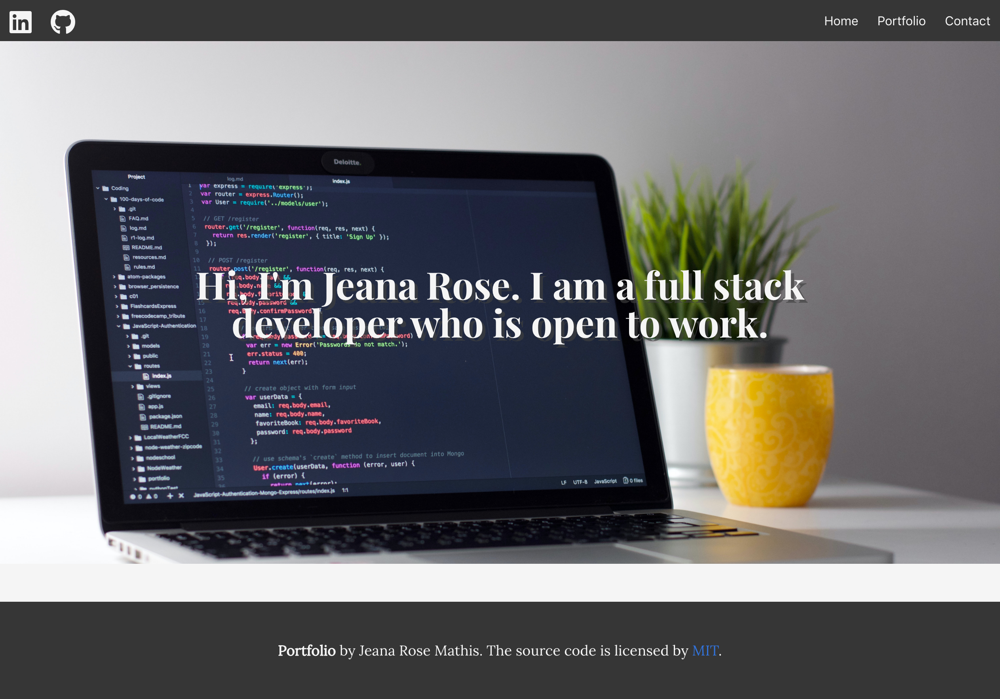
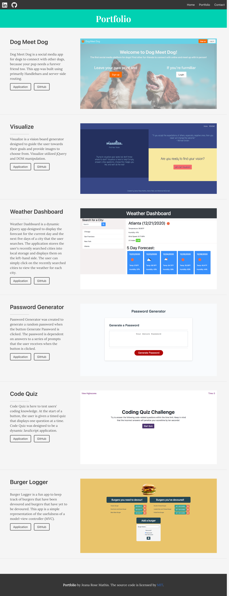

# Portfolio

## Description

[Portfolio](https://jeanarose.github.io/portfolio/) is a webpage that showcases my software development work. Portfolio was designed to be a responsive webpage using primarily React and Bulma. Several components were used to make this webpage responsive and follow best coding practices such as:

- React components, state, and hooks
- Use of Bulma classes
- A consistent navigation bar across all webpages
- Semantic HTML elements

View the deployed application here: https://jeanarose.github.io/portfolio/

## Portfolio

## Table of Contents

- [Installation](#installation)
- [Usage](#usage)
- [Credits](#credits)
- [License](#license)
- [Tests](#tests)

## Installation

1. Go to the [GitHub repository for Portfolio](https://github.com/jeanarose/portfolio).
2. Click the green **Code** button.
3. Copy the SSH key.
4. In your terminal, go into the directory that you want to host Portfolio.
5. Use the command **git clone [insert SSH key URL]** and click **Enter** (Requires Git).

## Usage

Portfolio can be used to view my work and source code. Simply click on the **Application** and **GitHub** buttons.
Use the social media links in the navbar to view my LinkedIn and GitHub profiles.

## Credits

- [Kristofer Giltvedt Selbekk - How to fade in content as it scrolls into view](https://www.selbekk.io/blog/2019/08/how-to-fade-in-content-as-it-scrolls-into-view/)
## License

MIT License

Copyright (c) 2021 Jeana Rose Mathis

Permission is hereby granted, free of charge, to any person obtaining a copy
of this software and associated documentation files (the "Software"), to deal
in the Software without restriction, including without limitation the rights
to use, copy, modify, merge, publish, distribute, sublicense, and/or sell
copies of the Software, and to permit persons to whom the Software is
furnished to do so, subject to the following conditions:

The above copyright notice and this permission notice shall be included in all
copies or substantial portions of the Software.

THE SOFTWARE IS PROVIDED "AS IS", WITHOUT WARRANTY OF ANY KIND, EXPRESS OR
IMPLIED, INCLUDING BUT NOT LIMITED TO THE WARRANTIES OF MERCHANTABILITY,
FITNESS FOR A PARTICULAR PURPOSE AND NONINFRINGEMENT. IN NO EVENT SHALL THE
AUTHORS OR COPYRIGHT HOLDERS BE LIABLE FOR ANY CLAIM, DAMAGES OR OTHER
LIABILITY, WHETHER IN AN ACTION OF CONTRACT, TORT OR OTHERWISE, ARISING FROM,
OUT OF OR IN CONNECTION WITH THE SOFTWARE OR THE USE OR OTHER DEALINGS IN THE
SOFTWARE.

## Tests

Interested in testing Portfolio? Check the following:

- Links are functioning properly
- Social media links open in new tab
- All webpages are responsive

---

© 2020 Trilogy Education Services, LLC, a 2U, Inc. brand. Confidential and Proprietary. All Rights Reserved.
